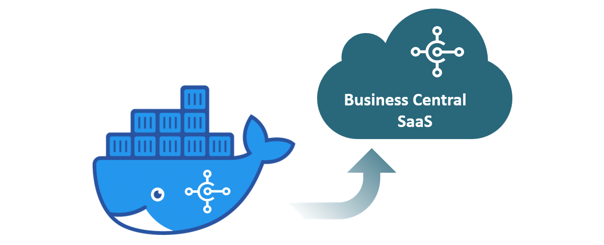

# 🚀 Business Central Docker Lab

Build your own Microsoft Dynamics 365 Business Central lab using Docker.

## What you'll learn

- Install Docker Desktop
- Install BcContainerHelper
- Create a Business Central container
- Access the Web Client
- Configure Visual Studio Code
- Publish your first AL extension

## Documentation

📄 Business Central Docker Lab Guide

## Scripts

PowerShell scripts included.

## Roadmap

- ✅ Docker
- ✅ BcContainerHelper
- 🔄 Visual Studio Code
- 🔄 AL Development
- 🔄 Dev Containers
